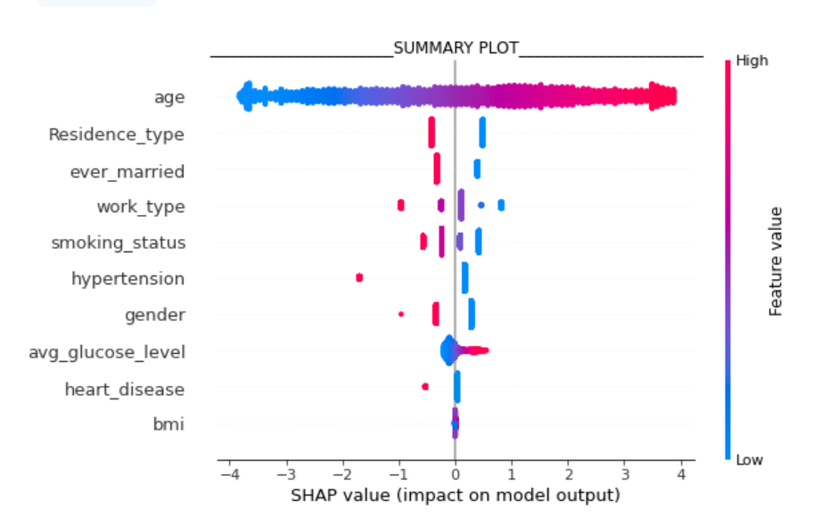

# Stroke-Prediction-XAI, 

● SHAP - For Global Feature importance Beewarm plot
● LIME (Local Interpretable Model-Agnostic Explanations) - For Local explanations.

**Objective**: To predict how prone a person is to get stroke? 

**Models explored**: RF, XGBoost, Logistic regression

**XAI-General shap plot**: Which features are more important to predict stroke and to predict if stroke is probable or non-probable 

**XAI LIME subject specific plot**: For a specific subject why they are probable or non probable for stroke.

